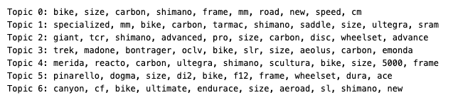
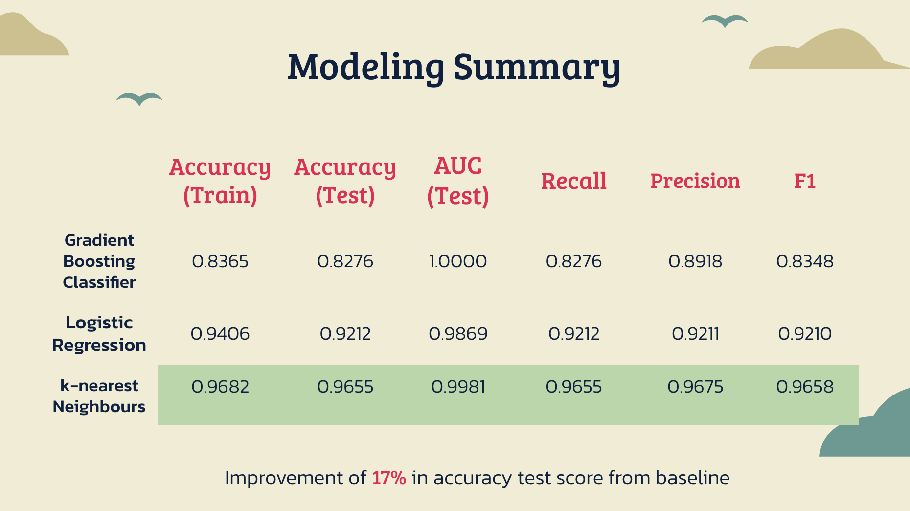
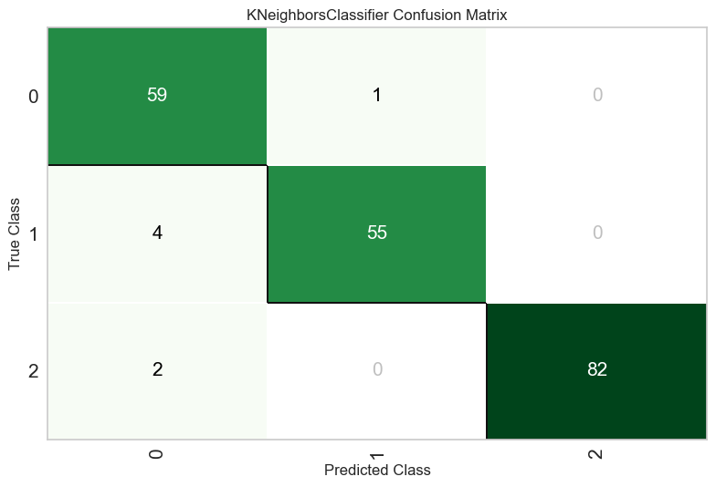
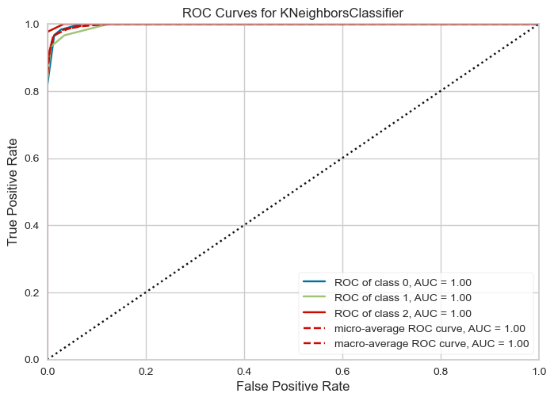
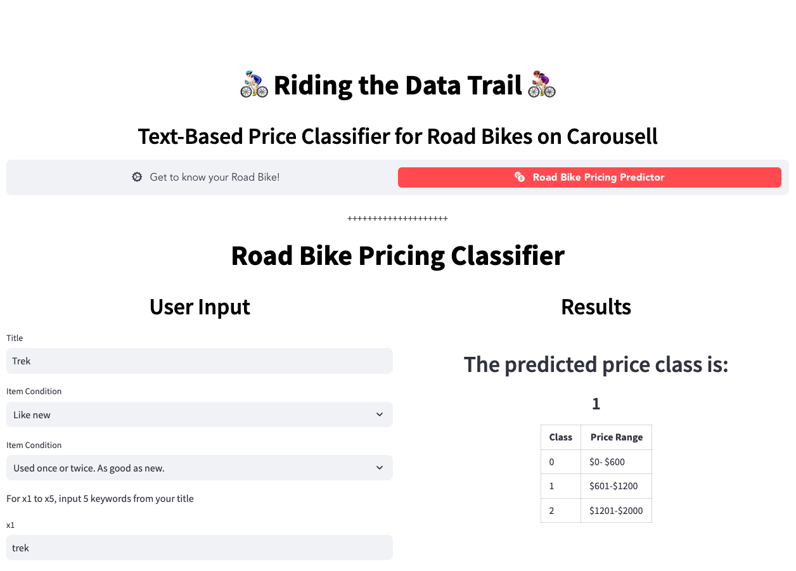
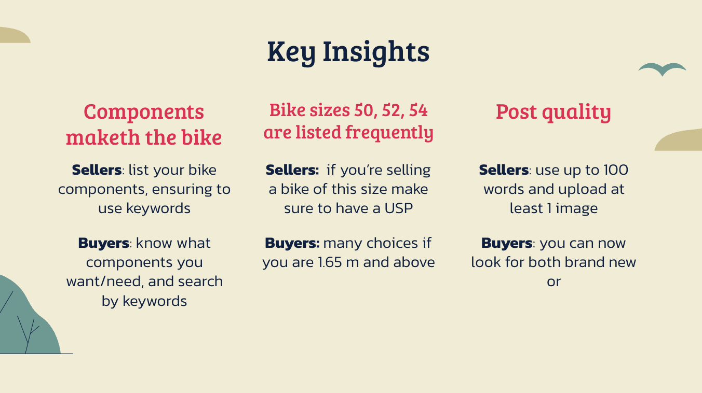
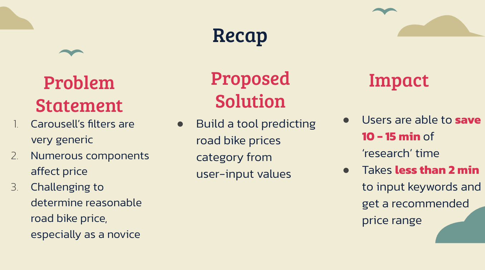
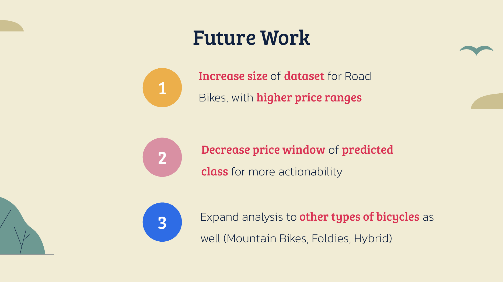

# Riding the Data Trail: Text-Based Price Classifier for Road Bikes on Carousell

## Table of Contents
- [Background](#background)
- [Data Scraping](#data-scraping)
- [Data Dictionary](#data-dictionary)
- [Modeling](#modeling)
- [Demo](#demo)
- [Key Insights](#key-insights)
- [Impact](#impact)
- [Future Work](#future-work)

## Background
* Did you know that Singapore has a total of [525 km of cycling paths](https://www.lta.gov.sg/content/ltagov/en/getting_around/active_mobility/walking_cycling_infrastructure/cycling.html) today (Aug 2023)? And that this is set to increase by fourfold by 2030, to 1,300 km?

* And that from 2027, the [North-South Corridor](https://www.lta.gov.sg/content/ltagov/en/upcoming_projects/road_commuter_facilities/north_south_corridor.html) will be ready in phases, and it will be Singapore's first Integrated Transport Corridor with dedicated cycling paths?

The Singapore government is building the necessary infrastructure to encourage cycling - both as a form of commute and for leisure. If you'd like to get in on the cycling action but do not already have a bicycle, chances are that you'll start your search on [Carousell](https://www.carousell.sg/), Singapore's favourite marketplace for buying and selling new or secondhand goods!

### Pain points of using Carousell for your bicycle search
1. Carousell is not specialized to each product; filters are very generic
2. There are so many components on a road bike which affects its value!
3. As a buyer / seller, it is difficult to know what’s a reasonable price to  buy / sell at, and even more challenging as a novice

### Proposed solution

> Build a tool predicting road bike prices category from user-input text values

## Data Scraping
Data scraping from Carousell was carried out using Beautiful Soup and Selenium libraries.

## Data Dictionary
| **Feature**             | **Type**   | **Dataset** | **Description**                                                          |
|-------------------------|------------|-------------|--------------------------------------------------------------------------|
| Unnamed: 0              | int64    | raw_df      | Index values                                                             |
| no_of_likes             | object     | raw_df      | The number of likes a post has                                           |
| no_of_images            | object     | raw_df      | The number of images in a post                                           |
| title                   | object     | raw_df      | Title of the post                                                        |
| listing_price           | object     | raw_df      | Price listed for the item in the post                                    |
| item_condition          | object     | raw_df      | Condition of the item being sold in the post: 'Lightly used', 'Well used', 'Like new', 'Brand new', 'Heavily used', 'New'                             |
| deal_method             | object     | raw_df      | Method of deal for the item in the post: 'Meetup', 'Mailing · Meetup', 'Mailing'                                  |
| post_date               | object     | raw_df      | When the post was made                                                   |
| category_type           | object     | raw_df      | Type of category the post belongs to; 'Road Bikes' was scraped           |
| post_type               | object     | raw_df      | Type of the post: 'Posted', 'Bumped'                                      |
| condition_subtext       | object     | raw_df      | Subtext about the condition of the item in the post: 'Used with care. Flaws, if any, are barely noticeable.', 'Has minor flaws or defects.', 'Used once or twice. As good as new.', 'Never used. May come with original packaging or tag.', 'Has obvious signs of use or defects.'                      |
| listing_description     | object     | raw_df      | Description in the listing of the post                             |
| mailing_option          | object     | raw_df      | Whether mailing option is available for the item in the post (Y/N)                       |
| delivery_options        | object     | raw_df      | Delivery options available for the item in the post: 'Standard delivery', 'Express delivery'                      |
| mail_speed              | object     | raw_df      | Speed of the mail service for the item in the post: '3-4 working days'                       |
| meetup_option           | object     | raw_df      | Whether meetup option is available of the item in the post (Y/N)                      |
| meetup_location         | object     | raw_df      | Location of the meetup for the deal of the item in the post              |
| seller_id               | object     | raw_df      | Identifier of the seller of the item in the post                         |
| seller_join_date        | object     | raw_df      | Date when the seller joined Carousell                                |
| seller_response         | object     | raw_df      | Seller's response to queries or comments: 'Mostly Responsive', 'Very Responsive', 'Not Responsive'                                 |
| seller_verif            | object     | raw_df      | Verification status of the seller: 'Verified', 'Unverified'                                       |
| verified_by_email       | float64    | raw_df      | Whether the seller is verified by email (1: Yes, 0: No)    |
| verified_by_facebook    | float64    | raw_df      | Whether the seller is verified by Facebook (1: Yes, 0: No) |
| verified_by_mobile      | float64    | raw_df      | Whether the seller is verified by mobile (1: Yes, 0: No)   |
| seller_stars_rating     | float64    | raw_df      | Star rating of the seller (number from 0-5)                                              |
| reviews_of_seller       | object     | raw_df      | Number of reviews the seller has                                         |
| url                     | object     | raw_df      | URL of the post                                                          |
| deal_location_lat       | float64    | raw_df      | Latitude of `meetup_location`                                            |
| deal_location_lon       | float64    | raw_df      | Longitude of `meetup_location`                                           |
| current_listing_price   | float64      | raw_df      | Current/only listing price of the item                     |
| last_listing_price      | float_64      | raw_df      | The previous listing price of the item, usually higher than `current_listing_price`     |
| posts                   | object     | cleaned_df  | combination of `title` and `listing_description`
| contains_brand          | bool       | cleaned_df  | Whether the row contains a brand from a list of brands defined |
| brands                  | object     | cleaned_df  | The brand identified if `contains_brand` is True            |
| len_posts               | int64    | cleaned_df  | The length of the `posts` field (i.e., number of characters)           |
| post_word_count         | int64    | cleaned_df  | The number of words in the `posts` field                               |
| emojis                  | object     | cleaned_df  | The emojis found in the `posts` field                                  |
| num_emojis              | int64   | cleaned_df  | The number of emojis found in the `posts` field                        |
| lemma_posts             | object | cleaned_df | Cleaned and lematized `posts`   |
| topic                   | object  | model_df   | Topics obtained from BERTopic |
| probabilities           | float64 | model_df | Max probability of topic for each row |
| x1, x2, x3, x4, x5, x6, x7, x8, x9, x10 | object | model_df | Top 10 words of topic identified for that row |
| price                   | int64 | model_df | Class of `current_listing_price`: (0: $0-$600, 1: $601-$1200, 2: $1201-$2000) |

## Modeling
### Pre-Modeling Prep
1. Identify columns and create a new dataframe to send into model
2. Use BERTopic for topic identification  
    a) Obtain top 10 words for each topic and append to dataframe  
3. Narrow down dataframe to listings **up to $2000**  
4. Feature engineer classes for `price`:  
    a) Low ($0 - $600) - Class 0  
    b) Med ($601 - $1200) - Class 1  
    c) High ($1201 - $2000) - Class 2

### Topics from BERTopic

### Models
Pycaret was used for modelling.

### Modeling Summary

## Demo
### Try out the streamlit demo [here](https://riding-the-data-trail-bicycle-price-classifier.streamlit.app/)!

## Key Insights

## Impact

## Future Work
